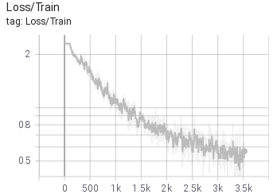
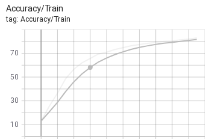

# AlexnetCifar
Implementation of a classical architecture from the paper "ImageNet Classification with Deep Convolutional Neural Networks" by Alex Krizhevsky , Ilya Sutskever , Geoffrey E. Hinton. on CIFAR10 dataset.

## Overview of the project
### Key Ideas
* Local Response Normalization
* Overlapping Pooling

### Architecture
The architecture of the AlexNet consists of the following layer blocks:
* (1) Conv2D + ReLU + LocalResponseNorm + MaxPooling (x2)
* (2) Conv2D + ReLU + MaxPooling (x1)
* (3) Conv2D + ReLU (x2)
* (4) Dropout + Linear + ReLU (x2)
* (5) Linear (x1)
### Dataset
Due to limited computational resources the significantly smaller dataset than ImageNet had to be chosen. CIFAR10 is a toy, well known dataset small dataset which consists of 60000 32x32x3 coloured images of 10 different classes (airplane, automobile, bird, cat, deer, dog, frog, horse, ship, truck). 

### File structure
`net.py` - contains model implementation  
`train.py` - contains `train_model` function responsible to taking care of training  
`main.py` - contains parsing arguments as well as main program loop  

## How to use it?
The usage is really straightforward. We call `python main.py <flags>` where `<flags>` indicate chosen flags.

### Available flags
`load_model_path` (default=None) - path to load trained weights  
`save` (default='<cwd>/checkpoints/model_<current_time>.pth') - path to save the model   
`train` (default=True) - flag controls whether we want to train the model or just used trained model to predict  
`predict` (default=False) - flag controls whether we want to predict the class of provided input image. Requires to specify input image with --input  
`resize` (default=[70, 70]) - resize input images before fitting into the model  
`random_crop` (default=[64, 64]) - random crop input images before fitting into the model  
`mean` (default=[0.5, 0.5]) - mean for normalization of the input images   
`std` (default=[0.5, 0.5]) - std for normalization of the input images  
`batch_size` (default=256) - size of the training batch  
`val_size` (default=-0.1) - percentage of the validation set  
`num_epochs` (default=25) - number of epochs  
`device` (default='cpu') - device on which the training will be run  
`log_freq` (default=50) - number of iterations between logging current state of the training  
`logger` (default=50) - number of iterations between logging current state of the training  
`fraction_of_data` (default=1.0) - percentage of the dataset used for training  

## Training Results

