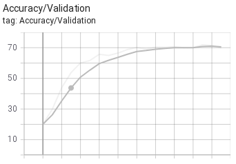

# AlexNetCifar10-Pytorch
Implementation of a classical architecture from the paper "ImageNet Classification with Deep Convolutional Neural Networks" by Alex Krizhevsky , Ilya Sutskever , Geoffrey E. Hinton. on CIFAR10 dataset.


## Overview of the project
### Key Ideas
* Local Response Normalization
* Overlapping Pooling
* Deep Convolutional Network

### Architecture
The architecture of the AlexNet consists of the following layer blocks:
* (1) Conv2D + ReLU + LocalResponseNorm + MaxPooling (x2)
* (2) Conv2D + ReLU + MaxPooling (x1)
* (3) Conv2D + ReLU (x2)
* (4) Dropout + Linear + ReLU (x2)
* (5) Linear (x1)
### Dataset
Due to limited computational resources the significantly smaller dataset than ImageNet had to be chosen. CIFAR10 is a toy, well known dataset small dataset which consists of 60000 32x32x3 coloured images of 10 different classes (airplane, automobile, bird, cat, deer, dog, frog, horse, ship, truck). 

### File structure
`net.py` - contains model implementation  
`train.py` - contains `train_model` function responsible to taking care of training  
`main.py` - contains parsing arguments as well as main program loop  

## How to use it?
The usage is really straightforward. We call `python main.py <flags>` where `<flags>` indicate chosen flags.

### Available flags
`load_model_path` (default=None) - path to load trained weights  
`save` (default='<cwd>/checkpoints/model_<current_time>.pth') - path to save the model   
`train` (default=True) - flag controls whether we want to train the model or just used trained model to predict  
`resize` (default=[70, 70]) - resize input images before fitting into the model  
`random_crop` (default=[64, 64]) - random crop input images before fitting into the model  
`mean` (default=[0.5, 0.5]) - mean for normalization of the input images   
`std` (default=[0.5, 0.5]) - std for normalization of the input images  
`batch_size` (default=256) - size of the training batch  
`val_size` (default=-0.1) - percentage of the validation set  
`num_epochs` (default=25) - number of epochs  
`device` (default='cpu') - device on which the training will be run  
`log_freq` (default=50) - number of iterations between logging current state of the training  
`logger` (default=50) - number of iterations between logging current state of the training  
`fraction_of_data` (default=1.0) - percentage of the dataset used for training  

## Training Results





## Credits  
 
### ImageNet Classification with Deep Convolutional Neural Networks   
Krizhevsky, Alex and Sutskever, Ilya and Hinton, Geoffrey E.  

#### Abstract  
We trained a large, deep convolutional neural network to classify the 1.2 million
high-resolution images in the ImageNet LSVRC-2010 contest into the 1000 different classes. On the test data, we achieved top-1 and top-5 error rates of 37.5%
and 17.0% which is considerably better than the previous state-of-the-art. The
neural network, which has 60 million parameters and 650,000 neurons, consists
of five convolutional layers, some of which are followed by max-pooling layers,
and three fully-connected layers with a final 1000-way softmax. To make training faster, we used non-saturating neurons and a very efficient GPU implementation of the convolution operation. To reduce overfitting in the fully-connected
layers we employed a recently-developed regularization method called “dropout”
that proved to be very effective. We also entered a variant of this model in the
ILSVRC-2012 competition and achieved a winning top-5 test error rate of 15.3%,
compared to 26.2% achieved by the second-best entry.  

[[Paper]](https://proceedings.neurips.cc/paper/2012/file/c399862d3b9d6b76c8436e924a68c45b-Paper.pdf)

```bibtex
@inproceedings{10.5555/2999134.2999257,
author = {Krizhevsky, Alex and Sutskever, Ilya and Hinton, Geoffrey E.},
title = {ImageNet Classification with Deep Convolutional Neural Networks},
year = {2012},
publisher = {Curran Associates Inc.},
address = {Red Hook, NY, USA},
abstract = {We trained a large, deep convolutional neural network to classify the 1.2 million high-resolution images in the ImageNet LSVRC-2010 contest into the 1000 different classes. On the test data, we achieved top-1 and top-5 error rates of 37.5% and 17.0% which is considerably better than the previous state-of-the-art. The neural network, which has 60 million parameters and 650,000 neurons, consists of five convolutional layers, some of which are followed by max-pooling layers, and three fully-connected layers with a final 1000-way softmax. To make training faster, we used non-saturating neurons and a very efficient GPU implementation of the convolution operation. To reduce overriding in the fully-connected layers we employed a recently-developed regularization method called "dropout" that proved to be very effective. We also entered a variant of this model in the ILSVRC-2012 competition and achieved a winning top-5 test error rate of 15.3%, compared to 26.2% achieved by the second-best entry.},
booktitle = {Proceedings of the 25th International Conference on Neural Information Processing Systems - Volume 1},
pages = {1097–1105},
numpages = {9},
location = {Lake Tahoe, Nevada},
series = {NIPS'12}
}
```


